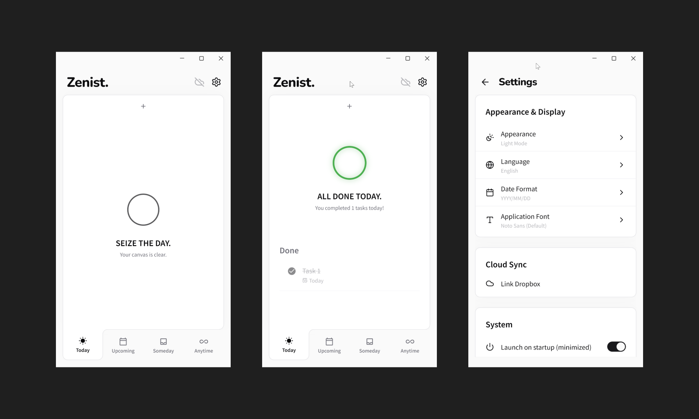

# Zenist.

[English](README.md) | [繁體中文](README.zh-TW.md) | [简体中文](README.zh-CN.md)

> A minimalist task management application focused on clarity and productivity.


<br>
<p align="center">
  
</p>
<br>
---

## FEATURES

- **Clarity First**: A distraction-free interface built with strict monochrome aesthetics. No emojis, no vibrant colors.
- **Local Persistence**: All data is stored locally on your device for absolute privacy and lightning-fast access.
- **Recurring Tasks**: Flexible scheduling for daily, weekly, monthly, or custom intervals.
- **Subtasks & Notes**: Break down complex objectives into actionable steps and attach contextual notes.
- **System Integration**: Seamless window management with tray support and background execution.
- **Internationalization**: Full support for multiple languages.

## TECH STACK

- **Framework**: Flutter / Dart
- **State Management**: Riverpod
- **Local Database**: Isar
- **UI Components**: Shadcn UI

## INSTALLATION

### Pre-built Binaries (Windows)

1. Navigate to the [Releases](https://github.com/ChiesiMario/Zenist/releases) page.
2. Download the latest `Zenist-Setup-vX.X.X.exe`.
3. Run the installer and follow the instructions.

### Build from Source

Ensure you have the Flutter SDK (>=3.12.2) installed on your system.

```bash
git clone https://github.com/ChiesiMario/Zenist.git
cd Zenist
flutter pub get
flutter build windows
```

## ARCHITECTURE

Zenist follows a clean, modular architecture separating concerns across presentation, domain, and data layers:

- `presentation/`: Riverpod providers, UI widgets, and dialogs.
- `domain/`: Core entities and business logic.
- `core/`: Application-wide utilities, theme definitions, and localizations.

## LICENSE

This project is licensed under the MIT License.